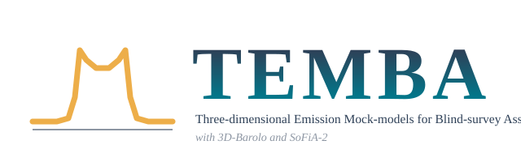

<p align="center"></p>

# TEMBA

**Three-dimensional Emission Mock-models for Blind-survey Assessments**, with 3D-Barolo and SoFiA-2.

TEMBA measures the completeness of an H I source catalogue: the probability that a galaxy with given properties, at a given place in a given cube, enters the catalogue. It injects model galaxies built with [3D-Barolo](https://bbarolo.readthedocs.io) into the survey's own cubes, with the catalogued sources removed, and searches them with the unmodified [SoFiA-2](https://gitlab.com/SoFiA-Admin/SoFiA-2) configuration that produced the catalogue.

- **Real noise:** each field's own cube, with its catalogued sources removed and the gaps refilled from the same spectra, so the models see the real noise, RFI and continuum residuals.
- **The catalogue's own settings:** the injected cubes are searched with the catalogue's SoFiA-2 parameter file, with only the file names changed.
- **A designed population:** galaxies drawn on a Latin hypercube in integrated SNR, linewidth, size and inclination, as tilted-ring discs with exponential profiles and arctan rotation curves. The rotation is iterated until each model's W50 matches its design.
- **Completeness in flux and in SNR:** unbinned logistic fits per field, with bootstrap errors, plus the dependence on linewidth, size, position and frequency.
- **Resumable campaigns:** many fields, realisations in sequence, fields in parallel; rerunning continues where it stopped.

## Installation

TEMBA needs Python 3.9 or newer, SoFiA-2 and 3D-Barolo (through its Python interface, pyBBarolo). The installer sets everything up in a conda environment:

```bash
git clone https://github.com/kvmophahlane/temba.git
cd temba
./install.sh            # conda env "temba": Python packages, wcslib, cfitsio, fftw,
                        # pyBBarolo, SoFiA-2 (compiled into ~/.temba), tests
conda activate temba
```

Other routes:

| route | command | notes |
| --- | --- | --- |
| conda by hand | `conda env create -f environment.yml` then `temba install-sofia` | the same as the installer |
| pip | `pip install ".[models]"` | needs wcslib, cfitsio and fftw already installed; then `temba install-sofia` or an existing SoFiA-2 |
| Docker | `docker build -t temba -f docker/Dockerfile .` | everything in one image |

`temba check` reports what is installed and what is missing.

## Quick start

```bash
temba init my_survey.yaml       # a commented parameter file
# edit it: one entry per field (cube, mask, SoFiA-2 parameter file, catalogue, ...)
temba check my_survey.yaml      # dependencies, inputs, provenance
temba run my_survey.yaml        # substrates, null runs, injections, SoFiA-2, matching
temba status my_survey.yaml     # progress
temba analyse my_survey.yaml    # completeness fits, figures, examiner tables
```

Everything is written under the parameter file's `workdir`:
- `fields/` holds the per-field configs;
- `substrates/` holds the source-free cubes and noise maps;
- `runs/<field>/run_NNNN/` holds each realisation;
- `logs/` holds the run logs;
- `analysis/` holds the results.

## The parameter file

`temba init` writes a fully commented template. The main settings:

| setting | meaning | default |
| --- | --- | --- |
| `fields[].name` | field name | required |
| `fields[].cube` | the cube SoFiA-2 searched (`from_par` reads it from the parameter file) | required |
| `fields[].mask` | SoFiA-2 mask of the catalogue | required |
| `fields[].sofia_par` | SoFiA-2 parameter file that produced the catalogue | required |
| `fields[].catalogue` | SoFiA-2 catalogue (VOTable), for the coverage and mass-limit figures | optional |
| `fields[].noise_cube` | SoFiA-2 noise cube, for diagnostics | optional |
| `fields[].chan_min`, `chan_max` | searched channel range, if SoFiA-2 flagged a band edge | whole band |
| `fields[].z` | cluster redshift, for mass limits | optional |
| `injection.sources_per_realisation` | galaxies per injected cube | 150 |
| `injection.sources_per_mvox` | or a density per million voxels (overrides the count) | off |
| `injection.total_per_field` | injections per field, split into realisations | 600 |
| `injection.realisations` | or a fixed number of realisations (overrides the total) | off |
| `injection.design` | ranges of log SNR, W50, d_HI/beam, inclination, surface density | see template |
| `injection.field_dependent_seeds` | different design draws in every field | false |
| `matching.beam_factor`, `dv_channels` | matching gate: beams on the sky, channels in velocity | 2, 2 |
| `run.parallel` | fields processed at once | 1 |
| `analysis.journal` | figure size and fonts: `mnras`, `aa` or `thesis` | mnras |
| `analysis.min_freq_mhz` | per-field band-edge cuts | none |

Any `injection`, `matching`, `substrate` or `tools` setting can be overridden for one field.

Fields set up before the survey file existed can be converted with `temba import <fields_dir>`. Existing `field.yaml` files are never overwritten unless you run `temba prepare --overwrite`.

## How it works

1. **Substrate.** The SoFiA-2 mask is dilated by 2 pixels and 2 channels. Masked voxels are refilled with values from the same spectrum at randomly shifted, unmasked channels. A per-pixel noise map (1.4826 × the median absolute deviation along the spectrum) is measured.
2. **Population.** A Latin hypercube in log SNR, log W50, log(d_HI/beam) and cos i, with the position angle uniform and positions uniform over the field. Velocities are kept clear of the band edges. Flux follows from S = SNR σ √(Δv W50) max(1, d/θ). Physical cuts apply to surface density and size, and sources must not overlap.
3. **Models.** 3D-Barolo GALMOD discs with an exponential surface density, an arctan rotation curve and a 9 km/s dispersion. The rotation amplitude is found by a secant search on W50. Models are beam-convolved, channelised, scaled to the design flux, injected and verified. Every galaxy, including unresolved ones, is a 3D-Barolo model; the smallest are 0.25 beams.
4. **Recovery.** SoFiA-2 is run with the catalogue's parameter file. A catalogue source within `beam_factor` beams and max(`dv_channels` channels, W20/2) of an injected galaxy is matched to it, by a one-to-one optimal assignment. For each recovered galaxy, the capture (flux inside the mask) and fidelity (catalogued over injected flux) are recorded.
5. **Completeness.** A logistic in log S and in log SNR, fitted by binomial maximum likelihood to every injection, with bootstrap errors. Dependences on linewidth, size, position and frequency are measured too.

## Using it for MGCLS-HI

`examples/mgcls_hi_survey.yaml` shows the twelve MGCLS-HI DR1 fields and how to add more. The MGCLS-HI settings that differ from the defaults:
- `sources_per_mvox: 0.806`, about 550 sources per full-band cube;
- four realisations per field;
- band-edge cuts for J0314.3-4525, J0351.1-8212 and J0431.4-6126.

## Testing

```bash
python -m pytest -q
```

The tests cover the statistics, the matching, the parameter file and the command line. They need neither SoFiA-2 nor 3D-Barolo.

## Citing

Please cite TEMBA through its Zenodo DOI (see `CITATION.cff`), and also SoFiA-2 (Westmeier et al. 2021, MNRAS 506, 3962) and 3D-Barolo (Di Teodoro & Fraternali 2015, MNRAS 451, 3021).

## Licence

MIT; see `LICENSE`. SoFiA-2 and 3D-Barolo are separate programs under their own licences, called by TEMBA but not distributed with it.
